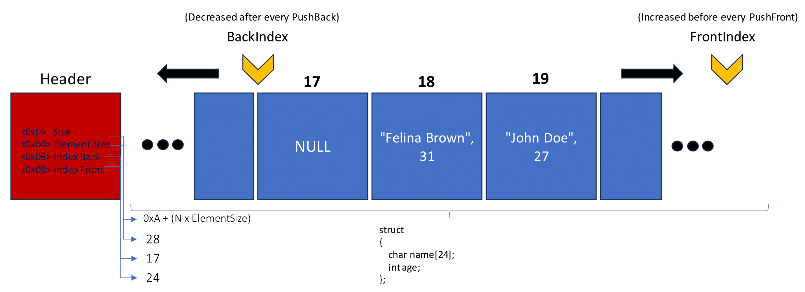

# Hxc Queue Reference

The queue allows **growing in both directions**. You can pass an alignment to the HxcQueueCreate function to determine a starting index/pointer. If 0 is passed, HXC_QUEUE_ALIGNMENT_MID is the default option.

``HXC_QUEUE_ALIGNMENT_BEG`` - Allows for faster forward growth
``HXC_QUEUE_ALIGNMENT_MID`` - Default
``HXC_QUEUE_ALIGNMENT_END`` - Allows for faster backward growth

### How does it work ?
The memory is stored in two parts; an inline header and the actual data.
The inline header (10 bytes) contains information that is needed for the data structure to work such as:

- The size of the queue (unsigned 4 byte integer)
- The size of an element (unsigned 2 byte integer)
- The index at the back of the queue (unsigned 2 byte integer)
- The index at the front of the queue (unsigned 2 byte integer)

# TODO:
- Dynamic resizing